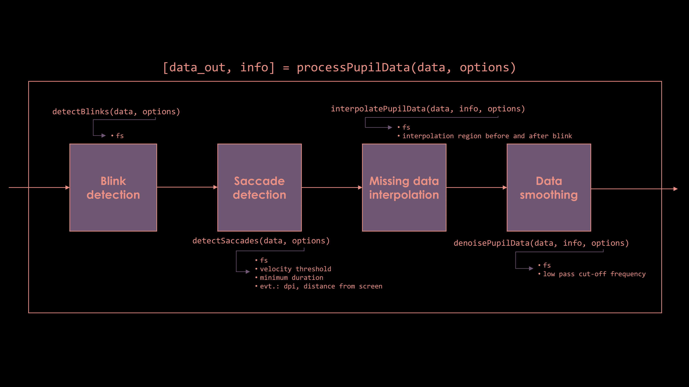

This is a repository for the PUPILS preprocessing pipeline, a matlab toolbox designed to clean and prepare raw pupil data for analysis.

# Installing the repository

To clone the repository do:

```
git clone https://gitlab.gbar.dtu.dk/heliaib/PUPILS-preprocessing-pipeline.git
 
```

Alternatively, the repository can also be downloaded using the GitLab interface.

# Data formatting

The input dataframe has rows corresponding to temporal samples and columns with different data categories. The minimum dataframe should
include **in that order**:

* time stamps 
* x-coordinate 
* y-coordinate
* pupil size
* In addition, x and y velocity values may be included

Additionally the options structure must be declared defining the options for the event detection algorithms, missing data interpolation and noise removal. If not declared, the pipeline will work in default mode, but this might result in suboptimal performance. Note that, currently, the pipeline works for one eye at a time. So when data for both eyes needs to be analysed two input structures must be created and the pipeline must be called twice. 

In turn, the pipeline outputs a dataframe that contains the original data with appended information, in the following order: 

* blink information
* saccade information
* interpolated data
* denoised data

If velocity data was not provided, the calculated velocity will be appended before the blink information (3D velocity, with one column only).


# Workflow

Description of the main functions and data structures in the pipeline (click for full size):



It is highly recomended to run the demo script to get familiarized with the data structure and available options.

# Software requirements

The pipeline was developed using Matlab 2019b.

# Contact

For feedback, questions and support using the toolbox, please contact: <heliaib@dtu.dk>
